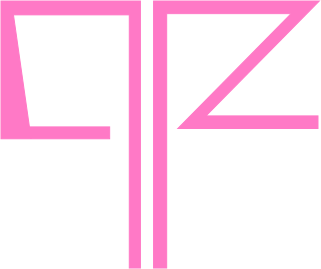

<h2 align="center">
   
  
   
  Pedro Ferreira
</h2>

  

  

  

  

## 📃 About
Pedro Ferreira's portfolio website..

---

## Technologies:
 - Next.js
 - Three.js
 - Chakra UI
 - Framer Motion
---
Made with ♥ by Pedro Ferreira :wave: [Get in touch!](https://www.linkedin.com/in/pedro-ferreira-b385131a2/)
